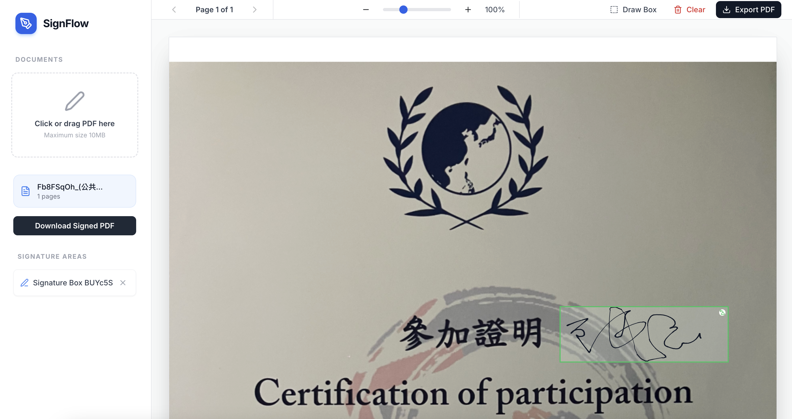

# PDF Signature

> Important: Before working on this project, read [AGENTS.md](AGENTS.md) for required workflows and tooling expectations.

PDF Signature is a lightweight web app for uploading PDF files, previewing pages, and adding signature overlays before saving the signed result. It focuses on a simple, guided flow so users can review a document, place a signature, and export the updated PDF in one place.

Key goals:
- Fast PDF preview and navigation
- Clear, minimal signing workflow
- Reliable export of the signed document

## Product Overview

### Sign Your PDF

Upload a PDF and draw your signature directly on the page. The app provides an intuitive signing experience — simply select the page, open the signature pad, and sign.



### Export the Signed PDF

Once you are happy with the signature placement, export the final signed PDF with one click. The signature is permanently embedded into the document and ready for sharing or archiving.


## Getting Started

> Before making changes, read the project guidelines in [AGENTS.md](AGENTS.md).

This project is managed with [Poetry](https://python-poetry.org/).

### Prerequisites

- Python 3.11.x
- Poetry


### Installation

1. Ensure Poetry uses Python 3.11:

```bash
poetry env use python3.11
poetry env info
```

2. Install dependencies:

```bash
poetry install
```

### Running the App

Start the development server:

```bash
poetry run ./reflex_rerun.sh
```

The application will be available at `http://localhost:3000`.

